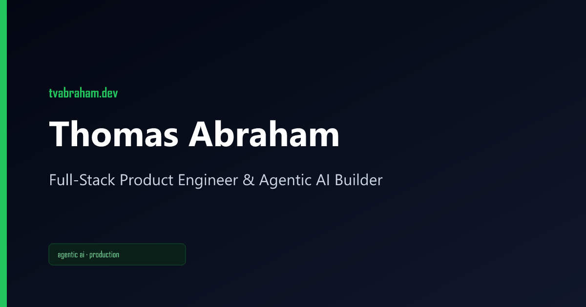
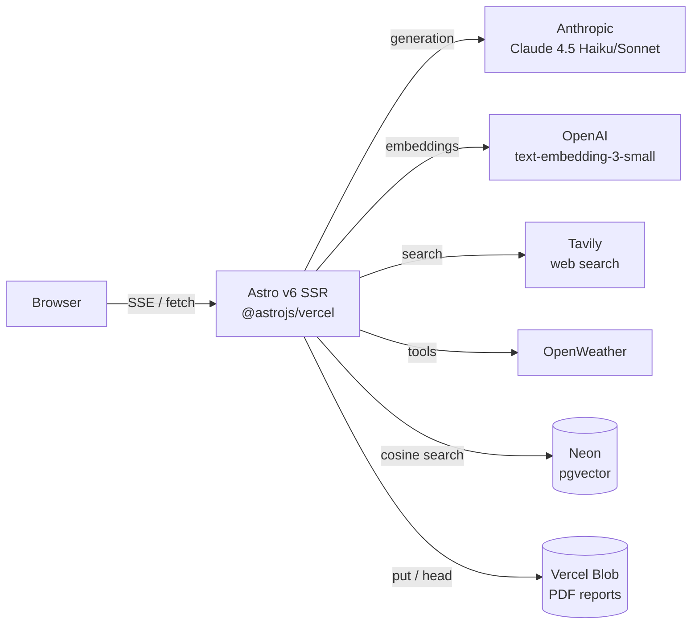

# Thomas Abraham — Agentic AI Portfolio

<p align="center">
  
</p>

> Full-Stack Product Engineer with 10+ years building scalable systems across the UK, NZ, and India. Currently in London, relocating to Adelaide in June 2026. This site is the working demo: four production-shaped agentic AI showcases running on real LLM APIs, not mocks.

**Live:** _to be deployed at https://thomas-abraham.vercel.app_

---

## The four showcases

| # | Showcase | Pattern | Route | What it proves |
|---|---|---|---|---|
| 1 | **Recursive Portfolio Chatbot** | Self-correcting RAG (LangGraph) | [`/about`](src/pages/about.astro) | retrieve → grade → rewrite → retry, with a "See Thoughts" toggle exposing the agent's reasoning trace. Real pgvector + OpenAI embeddings, Claude grader/generator. |
| 2 | **Deep Research Agent** | Plan-and-execute autonomous loop | [`/research`](src/pages/research.astro) | plan → search → fact-check → summarise. Real Tavily web search, Claude synthesis, downloadable PDF report stored in Vercel Blob. |
| 3 | **Software Architect Crew** | Multi-agent orchestration | [`/crew`](src/pages/crew.astro) | PM → Coder → Reviewer feedback loop with a live Mermaid flowchart highlighting which agent is "holding the token". Two-cycle review-and-revise loop with real Claude Sonnet writing production-grade code. |
| 4 | **Agent Skills Dashboard** | ReAct tool-use playground | [`/dashboard`](src/pages/dashboard.astro) | Claude Haiku decides each tool call from a registry: live geolocation (Vercel edge headers) → OpenWeather → portfolio mood recommendation. Cost + token trace rendered live. |

Every showcase has a documented mock-mode fallback so `npm run dev` works without provisioning anything except an Anthropic key.

---

## Architecture



The Astro shell ships zero JS by default; only the four interactive React islands (`AgentChatWidget`, `DeepResearchAgent`, `CrewOrchestrator`, `AgentPlayground`) hydrate, each with its own `client:*` directive. All AI logic lives in serverless API routes — the islands are thin SSE consumers.

---

## Tech stack

| Layer | Choice |
|---|---|
| Frontend shell | **Astro v6** (SSR), **React 19** islands, **Tailwind v4** (Vite plugin, not the deprecated integration) |
| Generation | **Anthropic Claude 4.5** — Sonnet for synthesis, Haiku for planning/grading/reviewing. Vercel AI SDK v6. |
| Embeddings | **OpenAI** `text-embedding-3-small` (1536 dims) |
| Vector store | **Neon Postgres + pgvector** with HNSW cosine index |
| Web search | **Tavily** basic search (3 calls/report) |
| State graphs | **LangGraph** for Showcase 1's correction loop; async generators for Showcases 2–4 (cleaner SSE streaming for plan-and-execute) |
| File storage | **Vercel Blob** for cross-invocation PDF persistence |
| Deploy | **Vercel** (`@astrojs/vercel` adapter, web analytics enabled) |

---

## Local development

```bash
git clone https://github.com/vathomas/digital-portfolio.git
cd digital-portfolio
npm install
echo 'ANTHROPIC_API_KEY=sk-ant-...' >> .env
npm run dev
```

Open http://localhost:4321. The minimum to demo all four showcases is just `ANTHROPIC_API_KEY`. Without the optional keys:

- **Showcase 1** retrieval falls back to keyword overlap over the in-memory corpus
- **Showcase 2** search falls back to clearly-labelled offline source stubs
- **Showcase 4** weather falls back to canned May-in-London data
- **Showcase 2** PDF storage uses an in-memory `Map` (works because dev keeps a single Node process alive)

Every fallback path logs a single line identifying which env var is missing.

### Useful scripts

```bash
npm run dev       # dev server with HMR
npm run build     # production build → .vercel/output/
npm run preview   # serve the prod build locally
npm run seed      # one-off: embed CORPUS into Neon pgvector
npm run og        # regenerate the 5 Open Graph PNGs
npm run astro check  # type-check all .astro files
```

---

## Production deployment

The full Vercel + Neon + Blob runbook lives in [`docs/DEPLOYMENT.md`](docs/DEPLOYMENT.md). Short version:

1. Import the repo into Vercel (`@astrojs/vercel` adapter auto-detected).
2. Storage → Create Blob (auto-injects `BLOB_READ_WRITE_TOKEN`).
3. Storage → Create Neon Postgres (alias `POSTGRES_URL` → `DATABASE_URL`).
4. Add API keys: `ANTHROPIC_API_KEY`, `OPENAI_API_KEY`, `TAVILY_API_KEY`, `OPENWEATHERMAP_API_KEY`.
5. `npm run seed` locally (embeds CORPUS into pgvector).
6. Redeploy.

A representative single-user session that exercises all four showcases costs roughly **$0.08**. Vercel + Neon + Blob fit the free tiers for portfolio traffic.

---

## Ragas evaluation

Showcase 1 (the RAG chatbot) is evaluated against a fixed eval set of **n = 50** questions sourced from `eval/questions.jsonl` (Phase 3 Step 8b). The four standard Ragas metrics — faithfulness, answer relevancy, context precision, context recall — are scored by `gpt-4o-mini` as judge LLM and rendered live on the project page.

Until the CI eval gate runs, the page renders **PRELIMINARY** placeholder values and a yellow caption flagging that they're not from a real measurement. The CI gate (GitHub Actions, post-deploy on every Vercel Preview) will overwrite the frontmatter with measured values and fail the build if `faithfulness < 0.80`.

The other three showcases don't ship Ragas scores — they're not RAG. Keeps the eval claim honest.

---

## Quality gate (Phase 3 Step 8 — in progress)

The CI/CD pipeline is built in two stages, both running on every PR:

**Stage A — pre-deploy** (`.github/workflows/ci.yml`)
- Secret scanning (`trufflesecurity/trufflehog`)
- `astro check` type pass
- ESLint with `--max-warnings=0`
- Vitest unit tests for the LangGraph node logic (mocked LLMs)

**Stage B — post-deploy** (`.github/workflows/preview-eval.yml`)
- `wait-for-vercel-preview` action blocks until the Vercel Preview is live
- Python `ragas` job hits `${PREVIEW_URL}/api/chat`, scores 50 Q&A pairs, fails the build if `faithfulness < 0.80`
- Playwright E2E suite exercises all four showcases against the same Preview URL

Promotion to production happens automatically when both stages pass on a merge to `master`.

---

## Repository tour

```
src/
├── content/projects/        4 markdown project descriptors with rich frontmatter
├── content.config.ts        Zod schema (techStack, agentLogicType, ragas, …)
├── components/
│   ├── RagasCard.astro      4-tile metric card, traffic-light thresholds
│   └── islands/             React islands — one per interactive showcase
├── layouts/
│   ├── BaseLayout.astro     OG/Twitter/canonical meta, dark-mode shell
│   └── ProjectLayout.astro  Project detail page
├── lib/
│   ├── agent/
│   │   ├── graph.ts             Showcase 1 — LangGraph correction loop
│   │   ├── research-graph.ts    Showcase 2 — plan/search/factcheck/summarise
│   │   ├── crew-graph.ts        Showcase 3 — PM/Coder/Reviewer crew
│   │   ├── playground-graph.ts  Showcase 4 — Claude ReAct planner
│   │   ├── playground-tools.ts  tool registry: location/weather/time/projects
│   │   ├── knowledge.ts         CORPUS + retrieve() (pgvector or mock)
│   │   ├── research-store.ts    Vercel Blob persistence for PDF reports
│   │   ├── llm.ts               shared Anthropic + OpenAI providers
│   │   └── id.ts                strict isValidReportId() — defends path traversal
│   └── db.ts                Neon pg.Pool, TLS validation on
└── pages/
    ├── api/                 SSE routes — one per showcase + /research-pdf
    ├── about|research|crew|dashboard.astro   showcase landing pages
    └── projects/[slug].astro                 project detail
scripts/
├── seed-corpus.ts           idempotent pgvector schema + embed
└── generate-og.mjs          SVG → PNG OG card generator
docs/
└── DEPLOYMENT.md            full Vercel/Neon/Blob runbook
```

---

## Contact

**Thomas Abraham**
ta.abraham@outlook.com
[linkedin.com/in/tvabraham](https://www.linkedin.com/in/tvabraham)
London, UK → Adelaide, SA (June 2026)

---

## License

MIT — see [`LICENSE`](LICENSE) if/when added. The corpus content (CV excerpts, project descriptions) is mine; everything else is permissively licensed and is welcome to be borrowed.
